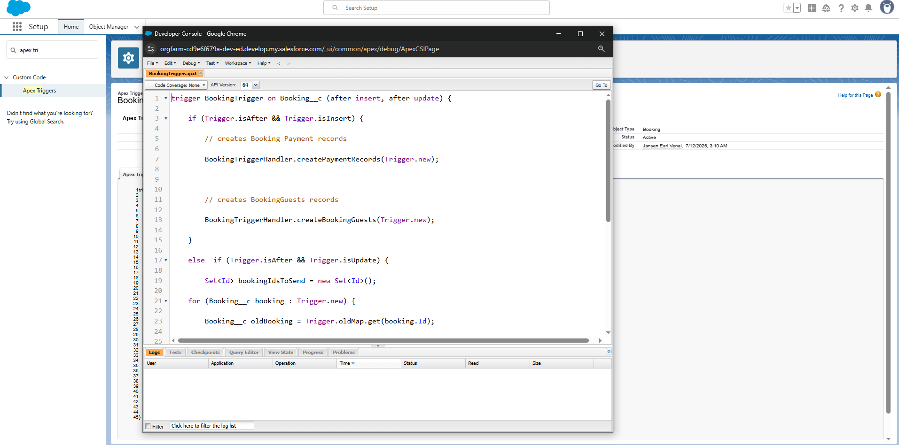

## Project Overview

The **Salesforce Tours & Travels Customer Relationship Management (CRM) Platform** is a tailored solution designed to optimize the core operations of travel and tour businesses by leveraging Salesforce’s robust CRM capabilities. This platform centralizes the management of client inquiries, travel package selections, bookings, payments, and post-travel feedback, providing a seamless and unified experience for both staff and customers.

By automating essential tasks such as booking approvals, customer notifications, and follow-up reminders using tools like **Flows** and **Process Builder**, the system significantly enhances operational efficiency and accuracy. It also elevates the customer experience through personalized communication and secure handling of sensitive information.

Moreover, the platform delivers real-time insights through **dynamic reports and interactive dashboards**, empowering travel agencies to make informed, data-driven decisions. Ultimately, this project offers a reliable, scalable CRM solution that enables agencies to streamline workflows, improve service quality, and support sustainable business growth.

## Documentations Links and References

## Tours and Travel Salesforce Documentation [Click here to view the full documentation](https://docs.google.com/document/d/1cALV3hFovfY-NoTzyRLODfsDWJ4vMqaomgWrMK_uwos/edit?usp=sharing)

# Phase 1: Requirements Analysis & Planning 
This phase focused on understanding the travel industry’s core business needs and translating them into a scalable Salesforce CRM solution. Key activities included gathering user requirements, defining project scope, and creating a technical roadmap to guide development. I designed the data and security models to reflect real-world travel workflows, supporting features such as booking management, customer tracking, and secure access control. This early planning ensured that the system would be structured, scalable, and aligned with both user expectations and long-term business goals.

## Understanding Business Requirements
The first milestone focused on uncovering key operational challenges faced by travel agencies, such as manual booking workflows, slow customer communication, lack of centralized feedback management, and limited cross-team coordination. By evaluating the needs of primary stakeholders—including travel agents, finance staff, and customers I translated these issues into concrete CRM requirements like booking automation, unified customer records, and real-time alerts. 

This phase deepened my understanding of how to bridge business problems with technical solutions. It also enhanced my ability to perform stakeholder analysis, prioritize user needs, and design a CRM system that addresses fragmented processes using Salesforce as an integrated platform.

## Defining Project Scope & Objectives
This milestone focused on clearly defining the scope and objectives of the CRM system. The platform was designed to manage the entire travel process from initial booking inquiries to post-trip feedback while remaining scalable for global use. Key functional needs included support for group travel, tiered memberships, dynamic pricing, and secure role-based data access. The overall goals were centered on streamlining operations through automation, improving communication speed, and enabling actionable insights through analytics.

Working through this phase strengthened my ability to set clear system boundaries. I learned the value of explicitly defining what the CRM should and shouldn’t include—especially within a limited development timeframe. This clarity helped shape development priorities and ensured that focus remained on delivering the most critical features first.

## Gathering & Analyzing User Needs

This milestone focused on understanding the unique expectations and workflows of various CRM user groups, including travel agents, customers, tour guides, finance personnel, and administrators. To simulate real-world interactions, I created user personas and mapped out journey flows using tools like Miro boards and feedback forms. From these insights, I identified essential features such as group travel management, dynamic pricing, automated follow-ups, and multilingual support.

Through this process, I learned the importance of putting user experience at the center of design. By walking through user journeys and identifying pain points, I was able to prioritize features that deliver meaningful value to each stakeholder. This phase reinforced how empathy-driven planning leads to more intuitive and effective system design.

## Identifying Salesforce Tools & Features

With the user and business requirements defined, I selected the appropriate Salesforce components to implement the desired functionality. Custom objects such as `Booking`, `TravelPackage`, and `Feedback` were planned to capture key data. To automate processes, I mapped requirements to tools like **Flows**, **Process Builder**, and **Approval Processes**. For advanced logic, features such as **Apex Triggers**, **Batch Apex**, and **Lightning Web Components (LWC)** were included. Security controls were planned using **Profiles**, **Permission Sets**, and **Sharing Rules**.

This step helped me understand how to match the right Salesforce tools to each business goal. It also taught me how to balance declarative solutions with code-based customization for optimal flexibility and long-term maintainability.

## Designing the Data Model & Security Architecture

In this milestone, I developed a relational data model to reflect how records connect across the CRM. Core relationships linked `Booking` with `Customer_Info`, `TravelPackage`, and `Employee` (as assigned guides). Supporting objects like `BookingGuest` and `Feedback` captured group details and post-travel insights. The security structure was built using a clear role hierarchy (e.g., Manager > Agent > Guide), field-level protections (e.g., finance-related fields hidden from agents), and record-level access managed through sharing settings.

This part of the project taught me how to design for both usability and data protection. I developed a stronger understanding of how Salesforce handles object relationships, access control, and compliance. Ensuring the right users have access to the right data, without sacrificing performance or security, was a key takeaway from this phase.

# Phase 2: Salesforce Development - Backend & Configuration

This phase focused on building the backend architecture of the Tours & Travels CRM using a combination of Salesforce's declarative tools and programmatic features. The objective was to define custom data models, apply validation rules, and automate critical processes like booking and payment workflows. Tools such as **Flows**, **Process Builder**, and **Apex** were used to ensure the system operates efficiently and scales with business growth. A total of **12 technical milestones** were completed, each contributing to a reliable, secure, and maintainable backend infrastructure.

## Milestone 1: Setting Up the Salesforce Developer Org

To kick off my Salesforce journey, I created a Salesforce Developer Org to serve as the foundation for hands-on practice and project development. I started by registering at [developer.salesforce.com/signup](https://developer.salesforce.com/signup), where I filled in the required fields—using "Developer" for both job title and company name. After submitting the form, I received a verification email, which I confirmed to activate the account. I then set up my password and successfully logged in via [login.salesforce.com](https://login.salesforce.com). With this setup complete, my dedicated Salesforce Developer environment was ready for building and testing CRM solutions.

## Milestone 2: Object Creation

To establish the core data structure for the **Tours & Travels CRM**, seven custom objects were created to represent key business entities:

- `Customer_Info__c`  
- `Booking__c`  
- `BookingGuest__c`  
- `TravelPackage__c`  
- `BookingPayment__c`  
- `Employee__c`  
- `Feedback__c`

Each object was designed with primary fields and **lookup relationships** to accurately reflect real-world business logic. For instance, the `Booking__c` object is linked to both the `Customer_Info__c` and `TravelPackage__c` objects, establishing crucial connections between customers, bookings, and tour packages.

This milestone strengthened my understanding of Salesforce’s **object-oriented architecture**. I learned that custom objects go beyond data storage—they define:
- Data relationships between entities  
- Automation logic (e.g., triggers and flows)  
- User interface elements and behavior  
By setting up these custom objects correctly, I laid a strong foundation for scalable development and CRM automation in later phases.

## Milestone 3: Tabs Creation

To enhance accessibility and navigation within the Salesforce interface, I created **custom tabs** for each of the core objects in the **Tours & Travels CRM** system.

### Steps Taken:
1. Navigated to `Setup`.
2. Searched for **"Tabs"** using the Quick Find box.
3. Selected the **Tabs** section under **User Interface**.
4. Under **Custom Object Tabs**, clicked **New** to begin the process.

For each tab:
- Selected the relevant custom object (e.g., `Customer_Info__c`).
- Chose a tab icon and color for visual representation.
- Kept default visibility settings for user profiles.
- Opted **not** to include the tab in apps by default but allowed it to appear in users' personal customizations.
- Clicked **Save** to finalize creation.

### Tabs Created for the Following Custom Objects:
- `Customer_Info__c`
- `Booking__c`
- `BookingGuest__c`
- `TravelPackage__c`
- `BookingPayment__c`
- `Employee__c`
- `Feedback__c`

## Milestone 4: Fields & Relationships
In this milestone, I focused on designing and implementing all essential fields and object relationships for the Tours & Travels CRM system. On the `Customer_Info__c` object, key fields such as `Email` were created using appropriate data types and configured to support search and reporting functionalities. A global picklist value set for `Country` was also defined and reused across various objects to maintain consistency and scalability.

To maintain relational integrity, a lookup relationship was established from the `Booking__c` object to `Customer_Info__c`, ensuring that every booking could be directly associated with a customer. In addition, a formula field was created on the `BookingGuest__c` object to dynamically calculate and categorize guest age groups, improving personalization and segmentation.

Picklist fields such as `Relation with Customer`, `Availability Status`, and `Payment Method` were added to capture critical business data. Multi-select picklists for fields like `Membership`, `Package Type`, and `Transportation Modes` enabled greater flexibility when defining travel offerings. For employee-related configurations, I added picklists for roles, departments, supported languages, and assigned regions. Location-specific fields like `Country` and `City` were tied to the global value sets, ensuring data consistency across all entries.

All field types were thoughtfully selected to support both user input and system automation. This setup ensures accurate data collection, real-world workflow alignment, and a strong foundation for reporting, automation, and future enhancements in the CRM.

## Milestone 5: Field Dependencies
To improve data accuracy and streamline user input across the CRM, I configured field dependencies between related picklist fields on key custom objects. On the `BookingGuest__c` object, a dependency was created between the `Country` and `City` fields. When a user selects a country, only cities relevant to that country become selectable, minimizing input errors and enhancing user experience.

On the `Booking__c` object, I implemented a dependency between `Membership` and `Preferred Accommodation`. Depending on the membership tier selected (e.g., Basic, Gold, or VIP), the system dynamically filters accommodation choices such as hotels, resorts, or villas. This ensures that booking options remain aligned with customer entitlements and business rules.

For the `Employee__c` object, I linked the `Department` field with the `Role` field, so that only appropriate roles—like Travel Agent, Finance Executive, or Tour Coordinator—appear under relevant departments such as Travel Operations, Finance, or Logistics. These dependencies help enforce logical consistency, reduce invalid entries, and simplify the user interface for data entry across the platform.

## Milestone 6: Validation Rules 

To uphold data integrity and enforce business-specific rules across the Tours and Travels CRM, I implemented several validation rules on key custom objects. On the `Customer_Info__c` object, validations were added to ensure that phone numbers contain exactly 10 digits, email addresses follow the correct format, and birthdates cannot be set in the future. For the `BookingGuest__c` object, the system enforces that age values must be greater than zero, and email addresses are required based on the assigned guest role.

On the `Employee__c` object, validation logic ensures that employees designated as guides must have at least one language selected, supporting complete and accurate role configuration. Additionally, the `Booking__c` object includes a rule that mandates all newly created booking records to default to a "Pending" status. These validation rules collectively reduce the risk of incorrect data entry and help maintain consistency and reliability across all records in the CRM.

## Milestone 7: Approval Process
To implement an approval workflow for booking cancellations, I first set up the necessary prerequisites, including user profiles, roles, and users. I created a classic email template to notify the Travel Agent Manager when a cancellation request is submitted, followed by two additional templates for approval and rejection responses. These templates personalize communication with customers based on the outcome.

The approval process was configured on the `Booking__c` object with criteria that trigger the workflow only when the booking status is set to "Cancelled" and the cancel confirmation checkbox is selected. The approval request is routed to the Travel Agent Manager, and the process displays essential booking fields such as the booking number, travel package, and cancellation reason.

Travel agents and booking owners are allowed to submit requests, which are then marked as "Pending." Upon approval, the system updates the approval status to "Approved" and sends a confirmation email to the customer. If rejected, the status reverts to "Confirmed," and a rejection email is sent. The process includes a single approval step and is now active, ensuring all cancellation requests are reviewed and resolved with clear communication.

## Milestone 8: Flows
To maintain data consistency and enforce booking constraints, I developed a Record-Triggered Flow on the `BookingGuest__c` object that prevents users from adding more guests than the number of travelers specified in a related booking. The flow is triggered during both record creation and updates. It begins by using a Get Records element to retrieve the associated `Booking__c` record along with its traveler count. A Decision element then evaluates whether the number of existing `BookingGuest__c` records already matches or exceeds the allowed number of travelers.

If the condition is met, a Text Template named `ErrorMessageTemplate` is used to display a message stating: “Sorry, we can't add more guests because the maximum number of Travellers for this booking has already been reached.” This message is shown to the user via a Custom Error element directly on the record page. After activating the flow, the system now enforces guest limits effectively, supporting accurate record management and ensuring alignment with the CRM’s business rules.

## Milestone 9: Workflows

To streamline post-travel engagement, I implemented a workflow rule on the `Booking__c` object that automatically assigns a follow-up task to the travel agent once a booking is marked as "Completed." This automation ensures consistent customer feedback collection. Within the Setup menu, I accessed the Workflow Rules section and created a new rule named "Follow-up Task After Booking Completion." The rule was set to run when records are created or edited, and it triggers specifically when the Booking Status field is set to "Completed."

As part of the rule's actions, I configured a new task to be assigned to the booking owner. The task includes a subject line “Follow up for feedback,” and is scheduled to be due three days after the booking's "Travelling End Date." The task was given a status of "Not Started," a priority of "Normal," and contains instructions for the agent to reach out to the customer to gather feedback. After saving and activating the workflow rule, the system now supports automated follow-up reminders, enhancing customer relationship management and service quality.

## Milestone 10: Process Builder

To enhance efficiency in the Tours and Travels CRM, I created a Process Builder automation that automatically updates a booking’s status to "Confirmed" once its associated payment is marked as "Completed." The process, titled **Update Booking to Confirmed When Payment Completed**, was set up to trigger when records in the `BookingPayment__c` object are created or edited.

Within the process, I defined the condition using the field `Payment_Status__c`, specifying that it must equal "Completed" using AND logic. Once this criterion is met, an immediate action is triggered to update the related `Booking__c` record. Specifically, the `Booking_Status__c` field is set to "Confirmed." After configuring and saving the process, I activated it to ensure that the system automatically updates booking statuses in real time, reducing the need for manual intervention and improving booking accuracy.

## Milestone 11: Triggers

As part of automating backend processes, I developed an Apex Trigger on the `Booking__c` object to handle post-insert actions. After logging into Salesforce and opening the Developer Console, I created a trigger named `BookingTrigger` that executes after a new booking record is inserted. The trigger delegates logic to a separate handler class, `BookingTriggerHandler`, for better maintainability.

Within the handler class, I implemented a method to automatically create a corresponding `BookingPayment__c` record for each new booking. The payment record is initialized with a default status of "Pending" to reflect its initial state. Additionally, I created another method called `createBookingGuests` to dynamically generate guest records based on the value in the `Number_of_Travelers__c` field. The system inserts that number of `BookingGuest__c` records and labels them sequentially (e.g., Guest 1, Guest 2, etc.).

With both features in place and tested, the trigger ensures that each new booking automatically generates its associated payment and guest records, reducing manual input and improving operational consistency across the CRM.

## Milestone 12: Asynchronous Apex

To support non-blocking performance and scalable background operations, I implemented three critical email notification processes using asynchronous Apex. First, I developed a `Future` method within the `BookingConfirmationEmailer` Apex class to send confirmation emails when a booking’s status is updated to “Confirmed.” This method is invoked by the modified `BookingTrigger`, which detects the relevant status change and passes the booking ID to the method.

Next, I created a `Queueable` Apex class called `BookingReminderQueueable`, designed to send reminder emails to customers three days before their tour begins. This class is executed daily by a `Schedulable` Apex class named `BookingReminderScheduler`, which queries bookings scheduled exactly three days ahead and enqueues the reminder logic. The job is scheduled using a CRON expression to run every day at 6 AM.

Lastly, I developed a `Batch` Apex class, `PaymentReminderBatch`, to notify customers about pending payments for bookings created the day before. The batch includes a `finish` method that alerts the system admin upon job completion. This batch job is managed by a separate `Schedulable` class, `SchedulePaymentReminderBatch`, and is configured to run each morning at 5 AM via the Salesforce UI Scheduler.

This milestone ensures that key notifications—booking confirmations, tour reminders, and payment alerts—are automatically delivered on schedule, optimizing both customer experience and internal efficiency.

# Phase 3: UI/UX Development & Customization
During Phase 3, I concentrated on crafting a streamlined, responsive, and user-friendly interface for the Tours and Travels CRM system. This involved designing and implementing custom Lightning Web Components (LWCs) and configuring Lightning Pages to ensure a smooth experience across both desktop and mobile devices. I also set up user authentication features and used Salesforce Flows to support efficient navigation and automate user interactions within the interface.

To enhance user accessibility and engagement, I customized record page layouts and leveraged dynamic forms with conditional visibility to show or hide fields based on record context. Reports and dashboards were personalized to deliver real-time insights tailored to each user role. Thorough testing was conducted across all UI components to validate responsiveness, functionality, and overall user experience.

## Milestone 13: The Lightning App

As part of Milestone 13, I developed a custom Lightning App called **"Tours & Travels CRM"** to provide users with a streamlined, centralized workspace. Through the App Manager in Salesforce Setup, I configured the app's branding by uploading a relevant logo and proceeded with default navigation and utility settings. I included all core objects essential to the CRM—such as `Customer_Info__c`, `TravelPackage__c`, `Booking__c`, `BookingPayment__c`, `BookingGuest__c`, `Employee__c`, `Feedback__c`, as well as `Tasks`, `Reports`, and `Dashboards`—to ensure comprehensive access to key functionalities.

To finalize the configuration, I assigned the app to the System Administrator profile to enable full access and control. After saving and activating the setup, the Lightning App became fully functional, serving as a centralized hub for managing travel and customer operations within the CRM system.

## Milestone 14: Editing of Page Layouts

This milestone focused on optimizing the page layouts of both standard and custom objects to improve usability and ensure a user-friendly experience within the Tours & Travels CRM. Through the Object Manager in Salesforce Setup, I modified the layout structure of key objects including `Customer_Info__c`, `BookingGuest__c`, `TravelPackage__c`, `Employee__c`, `Booking__c`, `BookingPayment__c`, and `Feedback__c`.

Each layout was thoughtfully organized to prioritize essential fields by positioning them at the top of the record page, while less critical or supporting fields were grouped logically beneath. This approach enhances data visibility, reduces the likelihood of input errors, and aligns the interface with typical user workflows. Once adjustments were completed, the updated layouts were saved and applied to ensure consistency across the system. These improvements contribute to a more streamlined and efficient CRM interface for end users.

## Milestone 15: Dynamic Forms 

To enhance the user experience by displaying context-sensitive fields, I enabled Dynamic Forms for the `Booking__c` object in the Tours & Travels CRM. First, I accessed the Booking tab through the App Launcher and created a new booking record to use as a reference. After saving the record, I opened it and selected **Edit Page** from the gear icon menu to launch the Lightning App Builder.

Inside the builder, I upgraded the Details section to Dynamic Forms by clicking **Upgrade Now**, choosing the existing Booking Page Layout, and completing the setup. With Dynamic Forms enabled, I configured field visibility rules to ensure that certain fields only appear based on specific conditions.

For instance, the `Cancellation Date`, `Cancel Confirmation`, and `Approval Status` fields were set to display only when the Booking Status is marked as “Cancelled.” These filters were applied individually to ensure that each field responds dynamically to the booking's status.

Once the visibility logic was configured, I saved the changes and activated the page by selecting **Org Default**. I also enabled the form for both desktop and mobile users to ensure consistency across devices. This setup allows users to interact with a cleaner and more relevant interface, reducing clutter and improving overall usability when managing booking records.

## Milestone 16: Users

Before creating users, it’s essential to complete the Profiles and Roles setup, as these define access levels and permissions. Once those configurations are in place, navigate to **Setup**, search for **Users** in the Quick Find box, and click on the **Users** section. Begin the process by selecting **New User** and entering the required information.

For the first user, input the name **Michael Jackson**, along with an alias, a valid email address, and a unique username in the format `example@example.com`. Assign a nickname for easier identification and select the **Travel Agent Manager Role**. Choose **Salesforce Platform** as the User License and set the Profile to **Travel Agent Profile**. Once saved, continue creating additional users using the same process.

Subsequent users should be assigned the **Travel Agent Role**, with the same license and profile settings. It’s recommended to create at least two users for each defined role to ensure role-based access is properly represented across the organization.

## Milestone 17: Reports

To begin configuring reports in the Tours & Travels CRM, I first accessed the Reports tab via the App Launcher and created a new report folder named **Revenue Folder**. After saving the folder, I navigated to the All Folders section, located the newly created folder, and configured sharing settings. View access was granted specifically to the **Travel Agent Manager** and **Finance Officer** roles, ensuring only relevant users could view financial reports.

Prior to building the reports, I added at least 10 records per object in the CRM, ensuring all fields were populated for richer data analysis. For the **Booking** object in particular, I made sure to set the Booking Status to "Pending" where necessary to support specific report filters.

The first report created was the **Monthly Revenue Report**, using the standard Booking report type. I selected fields like Booking Number, Customer, Booking Date, and Total Billing Amount, then applied filters to show only confirmed or completed bookings for the current month. To visualize revenue ranges, I used a bucket field on the Total Billing Amount, defining categories as Low (0–50,000), Medium (50,001–200,000), and High (>200,000). The report was grouped by Travel Package and Revenue Category, and displayed as a Pie Chart. It was saved in the Revenue Folder.

Next, I created three additional key reports:

- **Pending Payments Report**: Built using the "Booking Payments with Bookings" report type, this report filtered for Payment Status set to Pending and included relevant payment and customer fields. It was saved in the Revenue Folder.
  
- **Top Travel Packages Report**: Used the "Bookings with Travel Packages" type, grouped by package name, and summarized by booking count to reveal the most frequently booked packages. Sorted by descending count, it was saved under the same folder.
  
- **Employee Role Breakdown Report**: Focused on employee distribution, this report used the Employees report type and grouped records by Role, with a count summary to show the number of employees per role.

Finally, I planned and created at least five more custom reports tailored to various business needs, supporting deeper insights into bookings, customer trends, operational performance, and service feedback. These reports collectively provide essential visibility and decision-making support within the CRM system.

## Milestone 18: Dashboards

To visualize key performance metrics in the Tours & Travels CRM, dashboards were created using prebuilt reports. The process began by navigating to the Dashboards tab and clicking “New Dashboard.” A dashboard titled **Tours & Travels Dashboard** was created and configured by adding components through the canvas interface. The first widget added was based on the **Monthly Revenue Report**, displayed as a **Pie Chart** with a maximum of 10 values shown. The subtitle was set to *Total payments completed Bookings*, and the **Dark Theme** was applied for visual contrast. This configuration was saved to preserve the layout.

Three additional components were added using other reports from the Reports Milestone, each visualized using appropriate chart types such as bar graphs, line charts, or tables. These components provided distinct insights into areas like pending payments, popular travel packages, and employee performance, offering users a well-rounded view of business operations.

To access the completed dashboard, users can open the App Launcher, search for the **Tours & Travels CRM** app, and navigate to the Dashboards tab. From there, they can select and interact with the Tours & Travels Dashboard, which displays at least four fully configured components.

In addition to the main dashboard, two more dashboards were created using other reports from Activity 4. These dashboards focused on specialized views aligned with different roles—such as finance tracking or customer service trends—offering tailored insights across the organization.

## Milestone 19: Lightning Web Component Creation

This milestone focused on enhancing the user interface of the Tours & Travels CRM by developing a dynamic Lightning Web Component (LWC) that allows users to view travel packages filtered by the country selected on the booking form. The goal was to provide real-time interactivity without requiring a page refresh.

The backend logic was handled by creating an Apex controller named `TravelPackageController`, which included a method `getPackagesByCountry`. This method uses the `@AuraEnabled` annotation to enable server-side communication, returning a filtered list of travel packages based on the selected country.

On the frontend, an LWC named `TravelPackageSelector` was developed using Lightning Studio tools. The component’s structure included an HTML template that featured a `lightning-combobox` for country selection and a section to display the resulting travel packages. In the JavaScript controller, the `handleCountryChange()` function was implemented to call the Apex method and render the results dynamically on the UI.

The component’s metadata configuration (XML file) was updated to make it available on the App Page, Home Page, and Record Page. Once deployed, this LWC successfully provided real-time filtering of travel packages, improving usability and interactivity. This milestone demonstrated effective integration of Apex and LWC to deliver a responsive, intuitive user experience within the CRM.

## Milestone 20: Lightning App Page Creation
To improve the overall user experience, I integrated a custom Lightning Web Component into a dedicated Lightning App Page. Using the Lightning App Builder from Setup, I created a new App Page titled "Travel Package Selector" and chose a single-region layout to maintain a clean and focused design. I added the `travelpackageselector` component to the layout, saved the configuration, and activated the page. The new app page was then linked to the Tours & Travels CRM app to ensure easy access. Finally, I confirmed its availability through the App Launcher. When opened, the page enables users to choose a country and instantly view the associated travel packages, enhancing both interactivity and data visibility within the CRM system.

# Phase 4: Data Migration, Testing & Security
This phase focused on importing legacy data into Salesforce with a strong emphasis on data quality and system reliability. I applied thorough validation rules to maintain data integrity and conducted extensive testing—including unit tests, integration tests, and user acceptance testing (UAT)—to verify that all records were migrated correctly and that system behavior met expectations. In parallel, I implemented essential security configurations such as role-based access, sharing settings, and field-level restrictions to protect sensitive information and ensure adherence to organizational security standards.

## Milestone 21: Field History Tracking
To maintain a clear audit trail of critical data changes within the Tours & Travels CRM, I configured Field History Tracking on key objects. For the `Booking__c` object, tracking was enabled for fields such as Number of Travelers, Booking Status, and TravelPackage, allowing any updates to these values to be recorded and visible in the History related list. Similarly, the `TravelPackage__c` object was set up to track changes in Price Per Person and Availability Status, ensuring that all modifications to pricing and availability are monitored over time. This configuration supports greater transparency and accountability by allowing users and administrators to review historical changes to essential booking and package data.

## Milestone 22: Duplicate and Matching Rules
To maintain clean and reliable customer data within the `Customer_Info__c` object, a Matching Rule was configured to identify duplicate records based on a combination of email and phone number fields. This rule, titled **"Unique Email and Phone Number Combination"**, ensures that any records with identical values in these fields are flagged. The "Match Blank Fields" setting was enabled to allow comparison even if one of the fields is left empty, increasing the rule's flexibility and detection accuracy.

Following the creation of the matching rule, a Duplicate Rule named **"Unique Email and Phone"** was implemented to define how the system handles potential duplicates. This rule allows users to continue creating or editing records while providing a real-time warning message: *“Email and Phone must be Unique.”* The rule was linked to the previously created matching rule to ensure consistent behavior. Once saved and activated, these rules help enforce data quality standards while maintaining a smooth user experience during data entry.

## Milestone 23: Profiles

To enforce role-based access control in the Tours and Travels CRM, several custom profiles were configured by cloning base profiles such as “Standard Platform User” and “Salesforce Platform User.” Each profile was tailored to match the specific needs and responsibilities of the intended user type.

The **Travel Agent Profile** was created by duplicating the Standard Platform User profile. After setting the default app to the Tours and Travels CRM, the agent was granted Create, Read, and Edit permissions for key objects like Bookings, Booking Guests, Booking Payments, Customer Info, and Travel Packages. Read-only access was applied to Employee and Feedback records. Session timeout was set to 2 hours, and password settings were adjusted to require a minimum length of 8 characters with no expiration policy.

The **Tour Guide Profile**, based on the Salesforce Platform User template, was designed with restricted access. This profile only allows Read access to Bookings, Booking Guests, and Travel Packages, ensuring guides have visibility into essential records without edit privileges.

The **Finance Officer Profile** was similarly derived from Salesforce Platform User and provided with full access to Bookings and Booking Payments, enabling financial management while restricting changes to Travel Packages and Employee data through view-only permissions.

For marketing operations, the **Marketing Executive Profile** was granted full control over the Travel Package object to manage offerings and promotions. Read-only access was assigned to Bookings, Booking Guests, Customer Info, Employee, and Feedback objects to maintain visibility without editing capabilities.

Lastly, the **Customer Service Rep Profile** focused on handling client feedback. This profile was configured with full permissions on the Feedback object and read-only access to Bookings, Customer Info, and Travel Packages. This setup supports customer engagement without granting unnecessary control over sales or operations data.

These custom profiles helped ensure that every user role operates within defined access boundaries, promoting security, data integrity, and streamlined workflows.

